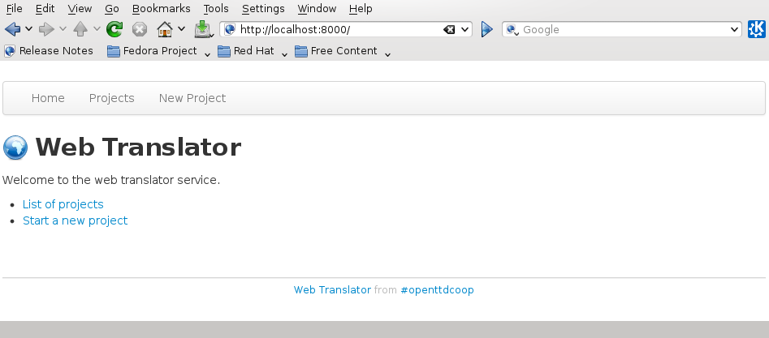
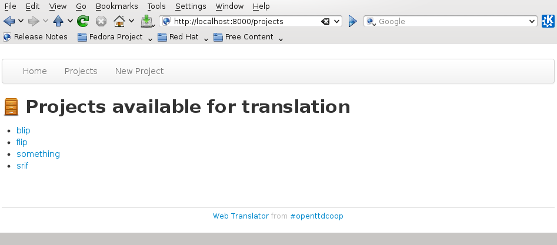
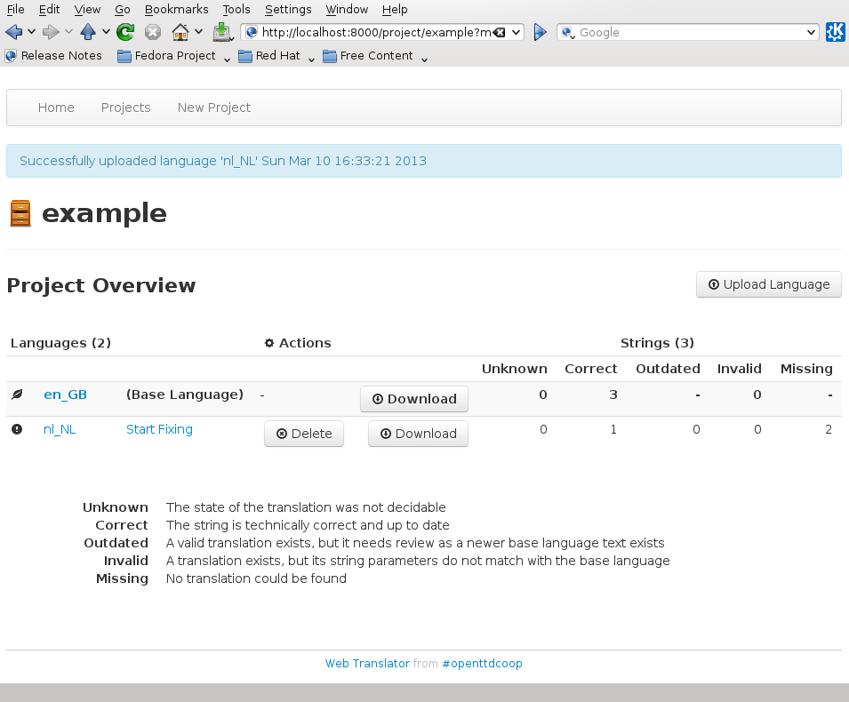
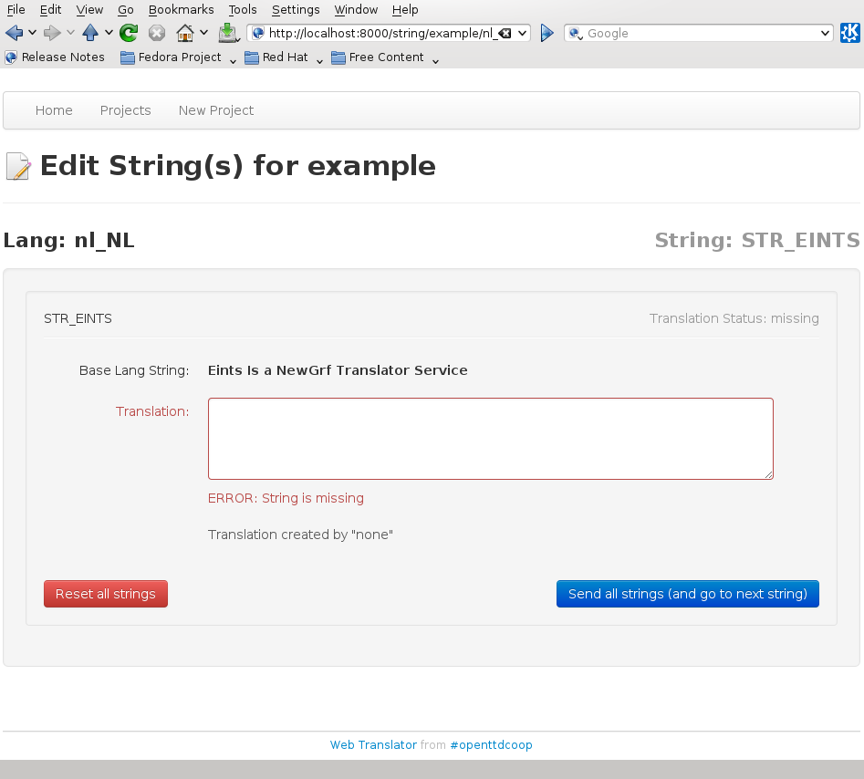
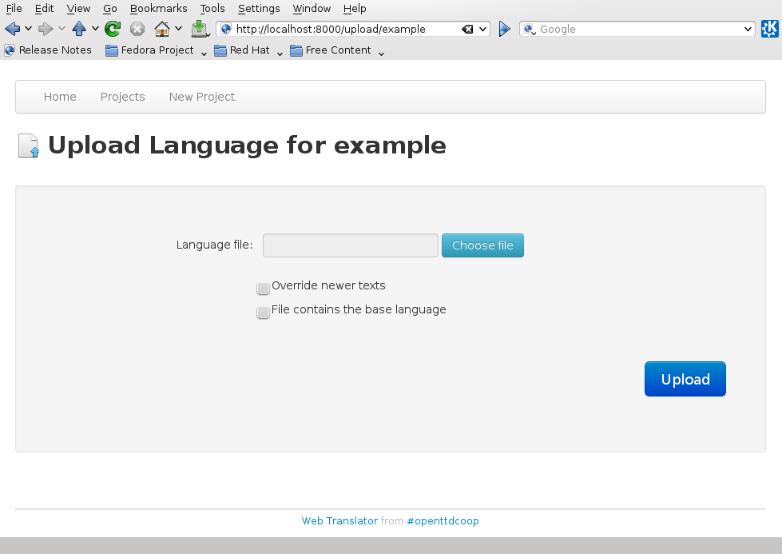
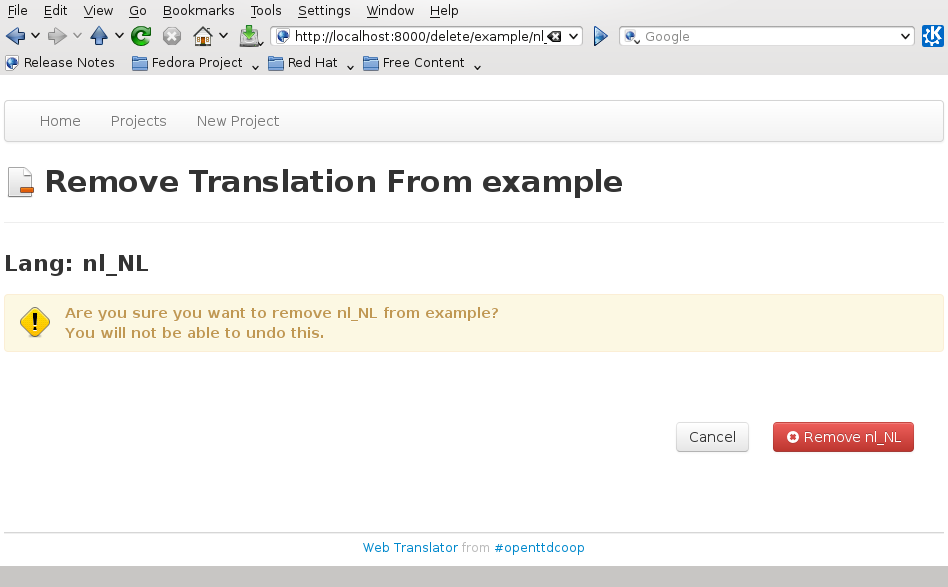

:Author: alberth and andythenorth
:Date: March 2013

.. contents::

===========================
Usage of the Web translator
===========================
The web translator works with a web browser. For your own safety, avoid using
passwords that are really important to you. Also, ensure the site you visit
uses a ``https`` prefix (for example ``https://translator.example.org/``)
rather than ``http``, since passwords are sent over the network.

To start using the web translator go to the root of the site.

The root page
-------------
Open a web browser, and go to the site. You will see a page like shown below.

The first link will bring you to an list of projects that have translations at
this server. This is explained further at `Projects list`_.

The second link allows you to create a new project, explained further at
`Create a new project`_. (You will probably need to be a project administrator
to do this.)

Projects list
-------------
The projects list looks like the image below.

It gives you an overview of the projects that exist at the site. To start
translating, pick a project, and click at its link. That will bring you to the
`Project overview`_ page.

Project overview
----------------
The project overview displays what the project contains. If it is empty, it
looks like

.. image:: upload_base_language.png

In Eints, a project has a base language that defines what strings exist, as
well as what each string should express. In addition, you can have
translations, which have the same set of strings (if they are complete).
The first thing to do is `Upload a language`_ (works for uploading base
languages as well as translations).

If you have uploaded a base language as well as some translations, you'll get
a project overview like

At the left you see a list of language names, starting with the base language.

Below *Actions* you see a `Delete a language`_ button, to remove a translation
language from the project (you cannot delete the base language). There are
also *Download language* buttons for each language that output a language file
ready for use in the project.

At the right, you see how many strings exist in the project, and the state of
the strings in each language:

Unknown
  The state of strings here is not known (does not happen, usually).

Correct
  Correct strings are newer than the translation, and use the same string
  commands. Whether the actual text actually translates the meaning of the
  base language is a different matter.

Outdated
  Strings here are older than the latest change in the base language, so they
  need to be checked.

Invalid
  These string use different commands (the text between curly bracket for
  example ``{BLACK}``). They need to be fixed.

Missing
  These strings do not exist in the translation yet.

From this overview, you can either go to the `Language overview`_ page by
clicking at the name of the language, or you can start `Editing strings`_ by
clicking at the *Start Fixing* link.

Language overview
-----------------
The language overview page lists all strings. It is often too big to display
at a screen. It looks like

.. image:: language_overview.png

At the top a bar to directly jump to each section. It also has the same
counts. Each section shows the current text of each string (except for the
missing strings of course).

If you click at a string name, you can start `Editing strings`_.

Editing strings
---------------
Editing a string is done at the following page.

In the center, an edit box for entering (or modifying) the text of the string.
Above it in bold font is the content of the string in the base language, so
you know what to translate.

If the translation has cases, the program will make such a translation box for
every case in the language. The first one (the default case) must always be
filled, the other ones may be left empty.

When you are happy with the new text, press the *Send all strings* button at
the right. If you made a mistake and are not sure what you changed, press the
*Reset all strings* button at the right, and all changes you made on this page
will be reverted.

If the string is correct, the program will bring you to the next string to
translate, or to the `Language overview`_ page if all strings are done.

Upload a language
-----------------
To create or update a language in the project, you need to upload a language.
The page looks like

In the form, select the language file from your system. If you are *uploading a
base language*, tick the bottom checkbox (It serves as a check that you upload
the right kind of file, and are not by accident overwriting something else.)

The top checkbox labeled *Override newer texts* is almost never needed.
If enabled, it forces that the strings of the file are seen as the newest
version in all cases.

If you downloaded a language file previously, and are
now uploading it again, the strings may have changed in the mean time by a
translator. If you want to overwrite those changes, tick the *Override newer
texts* check box.

Finally, press **Upload**, and the program will take you back to the `Project
overview`_ page.

Delete a language
-----------------
To delete a translation, press the *Delete language* button in the `Project
overview`_ page, and you will get a page like

Deleting a language means you will be deleting *everything* of that language,
in particular its history gets removed.

If you are sure the language should be deleted, press the *Remove* button.

After deleting, you will return to the `Project overview`_ page. If you change
your mind again about the language, you can re-add it by uploading its
language file again.

Create a new project
--------------------
To create a new project, enter a name in the form, and press the button.

.. image:: new_project.png

You will likely need to edit the ``projects.dat`` file as well, and restart
the server.

.. XXX Add a link to that text. We need Sphinx!!

.. vim: tw=78 spell
